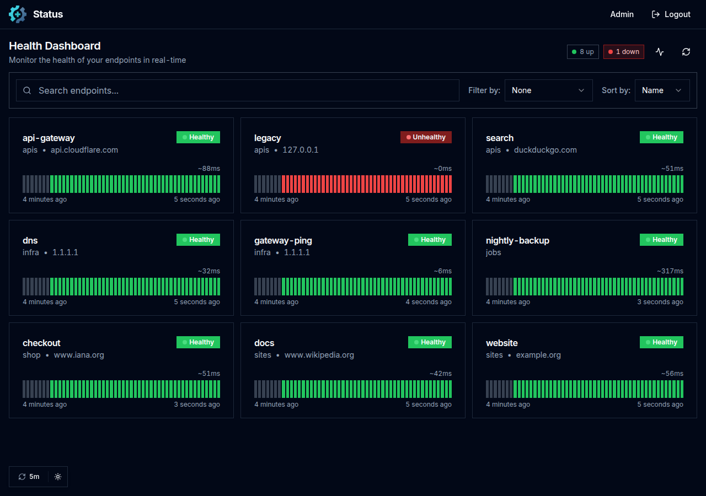

[](https://github.com/jniltinho/gatus)

# Gatus (jniltinho/gatus fork)

Health dashboard that monitors HTTP, ICMP, TCP, DNS and other services, evaluates conditions on the status, response
time, body and certificates, sends alerts and shows the history of every check.



## What this fork adds

This is a fork of [TwiN/gatus](https://github.com/TwiN/gatus). Everything from the original keeps working the same
way; on top of it:

| | |
|---|---|
| **Endpoint administration through the web** | Create, edit, disable and remove endpoints at `/admin`, without restarting Gatus. [docs/admin-endpoints.md](docs/admin-endpoints.md) |
| **Public status pages** | Pages open without login at `/status/<slug>`, with featured endpoints and a details page for every endpoint, while the dashboard stays protected. [docs/status-pages.md](docs/status-pages.md) |
| **MySQL and MariaDB storage** | `storage.type: mysql` for MySQL 8.4+ and MariaDB 10.11+, besides SQLite and PostgreSQL. [docs/storage-mysql.md](docs/storage-mysql.md) |
| **Push monitoring compatible with the Uptime Kuma** | Scripts and services report their status at `/api/push/<token>?status=up&msg=OK&ping=`, with Push endpoints, global keys, push on active endpoints and a Pending status with retries. [docs/push-monitoring.md](docs/push-monitoring.md) |
| **Response time chart of the Uptime Kuma** | Periods Recent, 3h, 6h, 24h and 1w, with the average, the minimum and the maximum, and columns for the failures. [docs/status-pages.md](docs/status-pages.md#response-time-chart) |
| **TLS certificate expiration** | Days until the certificate expires, below the name of the endpoint on the dashboard and, with `show-certificate-expiration`, on the status pages. [docs/status-pages.md](docs/status-pages.md) |
| **Login screen for `security.basic`** | A login page with logout instead of the browser dialog, with sessions stored in the database and a limit of failed logins, while `curl -u` keeps working. [docs/admin-endpoints.md](docs/admin-endpoints.md#login-screen) |
| **Backup and restore of the administration** | A JSON file with the endpoints, status pages and push keys, optionally encrypted, restored with a preview of what changes. [docs/admin-endpoints.md](docs/admin-endpoints.md#backup-and-restore) |
| **Interface of its own** | Dark mode by default, square style, thin scrollbar in the colours of the theme and the Inter font served by Gatus itself, without calling any external service. |

**[See every screen →](docs/screenshots/README.md)**

## Quick start

With Docker, using a fixed version (the fork does not publish `latest`):

```bash
mkdir -p config && curl -sL -o config/config.yaml https://raw.githubusercontent.com/jniltinho/gatus/master/config.yaml
docker run -d --name gatus -p 127.0.0.1:8080:8080 -v "$PWD/config:/config" jniltinho/gatus:v5.36.0-fork.24
```

Open http://127.0.0.1:8080.

Without Docker, download `gatus_<version>_linux_<amd64|arm64>.tar.gz` from the
[releases](https://github.com/jniltinho/gatus/releases) and run:

```bash
tar xzf gatus_5.36.0-fork.24_linux_amd64.tar.gz
GATUS_CONFIG_PATH=config.yaml ./gatus
```

## Minimal configuration

```yaml
endpoints:
  - name: website
    url: "https://example.org"
    interval: 1m
    conditions:
      - "[STATUS] == 200"
      - "[RESPONSE_TIME] < 500"
```

To keep the history across restarts, configure `storage` (`sqlite`, `postgres` or `mysql`):

```yaml
storage:
  type: sqlite
  path: /data/data.db
```

The administration and the login screen need `security` and `admin.enabled: true`. The password is a bcrypt hash in
base64, which [docs/generate-admin-password.py](docs/generate-admin-password.py) generates:

```yaml
security:
  basic:
    username: admin
    password-bcrypt-base64: "JDJhJDEwJD..."
admin:
  enabled: true
```

## Documentation

| Topic | Where |
|-------|-------|
| Screens of the fork | [docs/screenshots/README.md](docs/screenshots/README.md) |
| Full configuration: endpoints, conditions, alerting, storage, security, UI, suites, deployment and FAQ | [docs/README.md](docs/README.md) |
| Endpoint administration through the web, login screen, backup and restore | [docs/admin-endpoints.md](docs/admin-endpoints.md) |
| Public status pages and response time chart | [docs/status-pages.md](docs/status-pages.md) |
| MySQL and MariaDB storage | [docs/storage-mysql.md](docs/storage-mysql.md) |
| Push monitoring compatible with the Uptime Kuma | [docs/push-monitoring.md](docs/push-monitoring.md) |
| Docker Compose examples | [.examples](.examples) |

## Build from source

```bash
make frontend-install frontend-build   # only when changing the web interface
make build                             # binary in dist/gatus
```

The Go module is named `gatus/v5` and does not depend on the original repository, so the fork cannot be installed with
`go install`.

## Releases

Fork releases use `v<upstream-version>-fork.<N>` tags, with `linux/amd64` and `linux/arm64` tarballs on
[GitHub](https://github.com/jniltinho/gatus/releases) and the `jniltinho/gatus:<tag>` image on
[Docker Hub](https://hub.docker.com/r/jniltinho/gatus). There is no `latest` tag on purpose: pin the version you run.

## License

[Apache License 2.0](LICENSE), like the original Gatus by [TwiN](https://github.com/TwiN).
